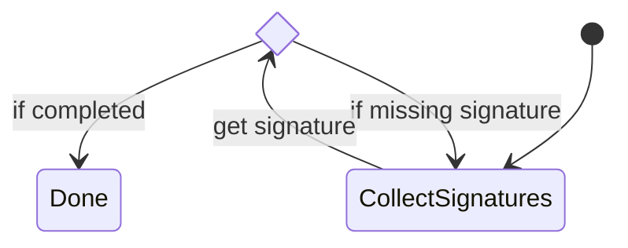

# Asfaload file signature specification

This document describes the signature scheme proposed by Asfaload to authenticate files published on the internet.
The authentication ensures the files published were made available by the people controlling the publishing account.

# File publishing workflow

To integrate with the Asfaload signature scheme, the published file needs to be covered by a checksums file generated by `sha256sum` or `sha512sum`.
This checksums file needs to be published alongside the file proposed for download.

This checksums file is mirrored in a git repository maintained by Asfaload. The path on the mirror is the download uri of the file, without the protocol scheme.
For example, the file available at URI `https://github.com/asfaload/asfald/releases/download/v0.5.1/checksums.txt` will be found in the mirror at the following
path: `github.com/asfaload/asfald/releases/download/v0.5.1/checksums.txt`.
A file can be present in multiple checksums files, e.g. one generated by `sha256sum` and one generated by `sha512sum`.
All checksums files are parsed and their content is put in the file `asfaload.index.json`. This index file makes it easy to identify the value of the checksum
for a file, as well as its location on the publishing platform.

It is the file `asfaload.index.json` that will be signed by publishers.

# Signature of a file

When we say a file is signed, we actually mean that its sha512 sum is signed. We don't pass the whole file content to the signing function,
the sha512 of the file is first computed, and that value is passed to the signing function.

# Publishing Repo

## Initial signers

We start by only working with Github, but aim to support other publishing platforms, including self-hosted solutions.
For Github, the initial signers file is published in the root of the code repository, which is distinct from releases location.
That's why for every publication platforms, we define the root location, where the initial signers file can be found, and the
releases location, where files to be downloaded can be found.
### Github
Before a project starts to sign releases with Asfaload, it has to communicate the signers and threshold to the Asfaload mirror.
This is done by adding a file `asfaload.initial_signers.json` of the git repo under the `main` or `master` branch.
This file will be copied to the Asfaload mirror in the root directory of the project under the name `asfaload.signers.json`.
Once the file has been copied, it can be deleted by a new commit, but it MUST be left as is in the git history. This is needed to allow
the validation of the chain of updates to the signers file.

```
{
  "version": 1,
  // We keep a trace of the first signers file published by the project.
  "initial_version": {
    // Permalink to the file. We cannot use the file from head, in case it is deleted (that's ok) or updated (shouldn't be done)
    "permalink": "https://raw.githubusercontent.com/asfaload/asfald/13e1a1cae656e8d4d04ec55fa33e802f560b6b5d/asfaload.initial_signers.json",
    // If the file is copied to multiple locations, these can be listed here
    "mirrors" : [
    ]
  }
  // ---------------------------------------------------------------------------------------------
  // These are the artifact signers accepted and their required threshold
  // Note this is an array and the threshold of each object in the array
  // has to be met for the signature to be complete.
  "artifact_signers" : [
    {
      "signers" : [
        { "kind": "key", "data": { "format": "minisign", "pubkey": "RWTsbRMhBdOyL8hSYo/Z4nRD6O5OvrydjXWyvd8W7QOTftBOKSSn3PH3"}  },
        { "kind": "key", "data": { "format": "minisign", "pubkey": "RWTUManqs3axpHvnTGZVvmaIOOz0jaV+SAKax8uxsWHFkcnACqzL1xyv"}  },
        { "kind": "key", "data": { "format": "minisign", "pubkey": "RWSNbF6ZeLYJLBOKm8a2QbbSb3U+K4ag1YJENgvRXfKEC6RqICqYF+NE"}  }
      ],
      // how many signatures are required to have
      // this requirement fulfilled
      "threshold": 2
    }
  ],
  // ---------------------------------------------------------------------------------------------
  // Master keys, use for reinitialisation of the `asfaload.signers.json` file.
  "master_keys" : [
    {
        "signers": [
            { "kind": "key", "data": { "format": "minisign", "pubkey": "RM4ST3R1BdOyL8hSYo/Z4nRD6O5OvrydjXWyvd8W7QOTftBOKSSn3PH3"} },
            { "kind": "key", "data": { "format": "minisign", "pubkey": "RM4ST3R285887D5Ag2MdVVIr0nqM7LRLBQpA3PRiYARbtIr0H96TgN63"} },
            { "kind": "key", "data": { "format": "minisign", "pubkey": "RM4ST3R3USBDoNYvpmoQFvCwzIqouUBYesr89gxK3juKxnFNa5apmB9M"} },
        ],
        "threshold": 2
    }
  ],
  // ---------------------------------------------------------------------------------------------
  // Following is optional.
  // Admin keys, are *optional*, but if present, are used for updates to the `asfaload.signers.json` file
  "admin_keys" : [
    {
        "signers": [
            { "kind": "key", "data": { "format": "minisign", "pubkey": "R4DM1NJ1BdOyL8hSYo/Z4nRD6O5OvrydjXWyvd8W7QOTftBOKSSn3PH3"} },
            { "kind": "key", "data": { "format": "minisign", "pubkey": "R4DM1NL285887D5Ag2MdVVIr0nqM7LRLBQpA3PRiYARbtIr0H96TgN63"} },
            { "kind": "key", "data": { "format": "minisign", "pubkey": "R4DM1NN3USBDoNYvpmoQFvCwzIqouUBYesr89gxK3juKxnFNa5apmB9M"} },
        ],
        "threshold": 2
    }
  ]
  },
]
}
```
When asfaload copies this file to the mirror, it is not signed yet and has the suffix `.pending` added. Signatures will be collected on the mirror.
Each user controlling a secret key corresponding to a public key listed will have to sign the `asfaload.signers.json` file and provide the signature to the
Asfaload backend.
It also creates a file `asfaload.signers.history.json` with the content `[]`. When signers files are updated, the historical versions will be recorded in that file.

Master keys are usable only for reinitialising a signers file, and should be kept offline. They are single usage, meaning
that when a signers file is reinitialised, the master keys signing the update cannot be present in the new file.
Master keys are also distinct from artifact signers, i.e. an artifact key cannot be a master key.
> [!WARNING]
> If the threshold for a master keys section is more than 1, how do we enforce single use of a
> master key as we don't know which of the awaiting signatures will be provided and which keys will
> stay unused?
> Enforcing expiration of all master keys at reinitialisation might be too much.


The backend will place the signature files on the mirror under `${project_root}/asfaload/signatures.pending/${base64urlnopad_of_pub_key}` (See [RFC4648](https://datatracker.ietf.org/doc/html/rfc4648#section-5)).
Here `${project_root}` is the path `/github.com/${user}/${repo}` on the mirror.
Each signer provides its signature, and it is immediately committed to the mirror.
When all signers (as required for a new signers file) have provided their respective signature, the file and directory are renamed by the backend to remove the `.pending` suffix, effectively becoming the
active signature configuration.

Each signers/keys field in the json is an array of object. The field `kind` initially only can have the value `key`,
but in the future could accept other values, for example such that the object itself can hold a group of signers with a threshold.
Each object list keys and a threshold.

For a signature to be complete, the requirements of each object needs to be fulfilled.
This was introduced to support requiring signatures from different groups (e.g. at least one signature from
the dev group and one from the QA group.)


# Mirror

## Key operations

### Master keys

Master keys are used for:
* Reinitialisation of `asfaload.signers.json`
* Changes in master signers configuration

Master keys are one-time use keys. Master keys signing the new `asfaload.signers.json` file cannot be present in it.

### Admin keys

If admin keys are defined, they are used for the following operations:

* Changes to `asfaload.signers.json` admin and artifact signers config, including threshold.

Admin keys can be used multiple times. They can also be used to sign artifacts, at the condition
they are explicitly listed as artifact signers. An admin key not listed as `asfaload.signers.json` artifact signer
cannot sign artifact.

If no admin key is configured, its role is implicitly taken over by the artifact signers keys.

### Artifact Signer keys

Those keys are used for:

* artifact signing.

If no admin keys are configured, the artifact signing config implicitly acts `asfaload.signers.json` admin config
(keys and threshold).

## Signers modifications

A new version of the file `asfaload.signers.json` is sent to our backend, signed by one of the current signers.
The new file is copied with the suffix `.pending` added and a directory `signatures.pending` is created to the repo's
root directory on the mirror.

If admin keys have been configured in the current signers file, only the admin keys are involved in signing off the
update (though new signers need to sign too to confirm they control the public key).
If no admin key was set up, the artifact signers need to validate the update.

To transition to the new setup, 3 conditions have to be met:
* The current signatories need to sign the new signers file according to the current signers file.
* The new signers file needs to be respected too.
* Any new signer is required to sign.

Example:
old: { threshold 2, signers [ A, B, C ]}
new: { threshold 3, signers [ A, B, C, D]}

This leads to these condition having to be met before transitioning to the new signature config:
* We need 2 signatures from A B C
* We need 3 signatures from A B C D
* We need signature D as it is a new signer.

An acceptable set of signatures of A B D, as it fulfills all 3 conditions.

Lowering the threshold example:
old: { threshold 3, signers [ A, B, C, D]}
new: { threshold 2, signers [ A, B, C, D]}

This leads to these conditions having to be met:
* 3 signatures from A B C D
* 2 signatures from A B C D, which is covered by the first condition
* no new signer is added, so no additional signature is required

> [!NOTE]
> The initial signers file process is a special case of these conditions, where there is no
> current config, and where all signers are new, which lets us condense everything in one requirement (all signers need to sign).

While collecting signatures, the new signatures are added under `signatures.pending` and committed to the mirror.
As soon as the 3 conditions are met, the current file (`asfaload.signers.json`)
and directory (`signatures`) are added in the file `asfaload.signers.history.json` and deleted, and the pending file and directories are
renamed dropping the `.pending` suffix, replacing the previous signers files.
Previous signers can also be found by looking at the git history if needed.

### Adding the previous signers and signatures to the history

Here is how the format of an entry in the array stored in the file `asfaload.signers.history.json`:

```
  {
    // ISO8601 formatted UTC date and time
    "obsoleted_at": "2025-02-27T08:48:44Z"
    "signers_file" : { ... content of signers file ....}
    "signature" : [
          // multiline strings cannot be stored as is in json, so we store the content
          // of a signature file in an array of strings, one string per line
          "base64urlnopad_of_pubkey1" : [ ... lines of signature file ...],
          "base64urlnopad_of_pubkey2" : [ ... lines of signature file ...]
      ]
}
```

Such an entry is **appended** to the array in the file
`asfaload.signers.history.json`, and the entries of the array are expected to
be sorted chronologically.


## New release

The checksums files are mirrored and the `asfaload.index.json` file is created. The current `asfaload.signers.json` file is also copied
under the release directory on the mirror.
Signatures are requested according to the signers file just copied to the release directory on the mirror.
For our example, let's assume that the key `RWTsbRMhBdOyL8hSYo/Z4nRD6O5OvrydjXWyvd8W7QOTftBOKSSn3PH3` is signing the release.
That user signs the `asfaload.index.json` file, and puts its signature under the release directory on the mirror in the subdirectory `signature.pending`
in a file named to the unpadded base64url encoding of the public key used: `signatures/UldUc2JSTWhCZE95TDhoU1lvL1o0blJENk81T3ZyeWRqWFd5dmQ4VzdRT1RmdEJPS1NTbjNQSDMK`.
The same directory contains the file `index.json` which allows to retrieve the signature files currently stored stored in the directory. It basically
lists the files stored in the directory to allow clients to retrieve in one request the list of all signatures currently collected. It has this format,
and this content based on our example:

```
{
    "signatures" : [
      "RWTsbRMhBdOyL8hSYo/Z4nRD6O5OvrydjXWyvd8W7QOTftBOKSSn3PH3"
    ]
}

```
When required signatures are collected, the directory `signature.pending` is renamed to `signatures`.


## Revocation

If a file published and signed appears to be malicious, the publishing project can revoke the signatures.
The revocation has to be signed according to the same conditions as a new release, i.e. respecting the file `asfaload.signers.json` of the project
(not the copy that was taken in the release directory at the time of the release. A revocation has to be done by current signers).

The revocation can be initiated by one of the signers. Revocation is done by setting the top field `revoked` in the file `asfaload.index.json` to `true`.
The file is updated and saved as `asfaload.index.json.pending` under the release directory and signatures are collected in the directory `signatures.pending`.
Once required signatures have been collected, the current `asfaload.index.json` and `signatures` are deleted and pending file and directory are renamed to
drop the `.pending` suffix, making it the current version.

> [!NOTE]
> The process is the same as signing a new release.

The revocation process always looks at the current signers. This means that if the file `asfaload.signers.json` is updated while a revocation is pending,
the signature requirements will change during the revocation process.

## Multi-sig analysis
### Key compromise

A key compromise is the event making the private key of a signer available to a third-party not supposed to have it.
If not handled correctly, such an event can be catastrophic and lead to publication and seemingly valid signing of malicious software.
Handling it correctly however is hard and may require some constraints.
Multi-signatures accounts can limit the impact of a key compromise, but only under certain circumstances. For example, a 1-of-2 account does not
bring any protection against key compromise, as the compromised key can take any action, including updating the signers.
As a conclusion, we can say that to protect against key-compromise, the multi-sig needs to require more than one signature (in m-of-n, m>1).
Also, per definition, an m-of-n multi-sig with n>m can protect against m-1 key compromise. (Compromised keys alone cannot validly sign, and
the participation of at least one non-compromised key is needed).
Of note is that the compromised key can still be used by its owner to sign multi-sig operations as long as it has not been revoked.
This means that the compromised key can sill participate in the m-of-n multi-sig to validate signers updates.

> [!NOTE]
> An m-of-n account can protect against the compromise m-1 keys.
### Key loss

A key loss event is quiet similar to a key compromise, with the difference that the key cannot sign anything.
If in the case of a key-compromise, said key can still participate to sign updates to the signers list, this is not the
case with a key loss.
It means that remaining signers should be able to sign changes.
As a conclusion, to protect against a key loss, we need to have m<n.
For a 3-of-5 account, we require the signature of 3 keys out of 5, meaning it can handle 2 key losses.
We can generalise this and say that an account m-of-n protects against n-m key losses.
> [!NOTE]
> An m-of-n account can protect against n-m key losses.

### Key compromises and key losses

For an m-of-n account, the worst situation is to have m-1 key compromised, and n-m other keys lost.
In that case, updates to the signers list can be signed by the m-1 owners of the compromised keys.
With n-m keys lost, it still means that m keys are available. m-1 of these are compromised, but it means that
on key is still safe and will be able to limit updates to the signers list to legitimate updates.

At the other end of the spectrum, if all lost keys are amongst the compromised keys, we are still safe.
We have m-1 keys compromised, and n-m keys lost.
If n-m>m-1, it means we have lost access to all compromised keys in addition
to some non-compromised keys. All accessible keys remaining are not compromised and can be safely used to
update the signers list.
We can illustrate this with a 3-of-8. Let's say we have the keys labeled `A` `B` `C` `D` `E` `F` `G` `H`.
We have 3-1 = 2 compromised keys (let's say A B, which we mark with *), and 8-3 = 5 keys lost (which we mark with x), of which 2 are compromised:
`Ax*` `Bx*` `C*` `D*` `E*` `F` `G` `H`

If n-m < m-1, it means we have lost less keys than the number of compromised keys.
For example, in a 3-of-4, we have 3-1 = 2 (compromises handled), and 4-3=1 (key loss handled).
Let's say we have the 4 keys labels `A`, `B`, `C`, and `D` and `A` and `B` are compromised (we mark them with a `*`). As
stated earlier, in this case all keys lost are amongst the compromised keys. So let's say `A` is lost (we mark it with `x`)
We end up with these keys: `Ax*` `B*` `C` `D`. We see we have keys `B*` `C` `D` available to generate a valid signature, and we need to
use a compromised key to sign the signers update.
We can generalise and say that when n-m < m-1 we will need to use compromised keys to update the signers list. But as the update still requires the signature of a non-compromised key,
the update is safe.

Multi-sig accounts protect against any combination between these two extremes.

### Signers security
Ideally, with a `m-of-n` account, `m>1` and `n>m`. However we recognise that a solo developer working occasionally on a small project, handling multi-sig keys might be too big a burden.
For other accounts, catastrophic events could lead to loss of more than `n-m` keys or the compromise of `n`.

Even though the number of occurrence of these events should be small, we need to let publisher reset their signers files.
That's why we include master key(s) in the `asfaload.signers.json`. Those keys
are supposed to be stored safely offline, possibly printed on paper, and can only
be used one time.
Using master keys to sign a new `asfaload.signers.json` file bypass the normal procedure
usually followed when updating the `asfaload.signers.json` file.

# Downloading a file

1. The downloader tool downloads the `asfaload.signers.json` file from the file's directory on the mirror, so it identifies the current signers on the mirror in the release directory.
2. The downloader initialises its valid signature count to 0.
3. The downloader downloads the file `asfaload.index.json`.
4. It extracts the threshold from the file and iterates over the authorised signers.
5. For each signer, it extracts the public key, and computes its unpadded base64url encoding (let's call it key64url).
6. It looks under the file's directory on the mirror if it finds the signature file for that public key.
To do that it looks for a file with the name `$key64url` under the directory `signatures`.
7. If the signature file is found, it downloads it.
8. As the downloader tool knows the public key, the signature, and the `asfaload.index.json` file, it can validate the signature. If the signature is valid, it increases its valid signatures count by 1.
9. If the signature count is equal to the threshold, the signature is complete and we stop iterating over signers in `asfaload.signers.json`
10. The file to be downloaded is now effectively downloaded
11. Once downloaded, the file's checksum is computed. The algorithm chosen by default is the best one found for the file (sha512 > sha256)
12. The checksum computed is compared to the checksums found in the `asfaload.index.json` and with the checksums file on the publishing platform. If all correspond, the file is saved at the requested location.
