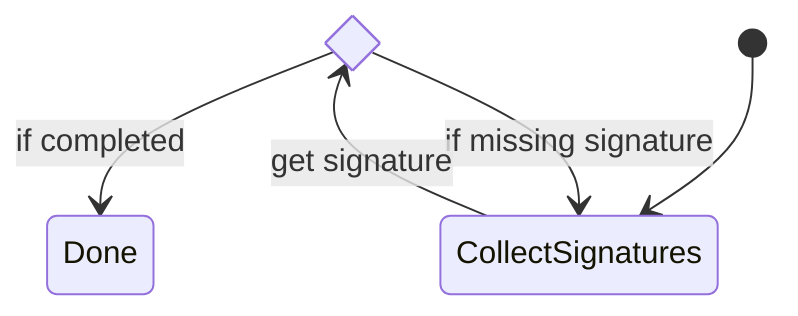

# Asfaload file signature specification

This document describes the signature scheme proposed by Asfaload to authenticate files published on the internet.
The authentication ensures the files published were made available by the people controlling the publishing account.

# File publishing workflow

To integrate with the Asfaload signature scheme, the published file needs to be covered by a checksums file generated by `sha256sum` or `sha512sum`.
This checksums file needs to be published alongside the file proposed for download.

This checksums file is mirrored in a git repository maintained by Asfaload. The path on the mirror is the download uri of the file, without the protocol scheme.
For example, the file available at URI `https://github.com/asfaload/asfald/releases/download/v0.5.1/checksums.txt` will be found in the mirror at the following
path: `github.com/asfaload/asfald/releases/download/v0.5.1/checksums.txt`.
A file can be present in multiple checksums files, e.g. one generated by `sha256sum` and one generated by `sha512sum`.
All checksums files are parsed and their content is put in the file `asfaload.index.json`. This index file makes it easy to identify the value of the checksum
for a file, as well as its location on the publishing platform.

It is the file `asfaload.index.json` that will be signed by publishers.


# Signing a file

When we say a file is signed, we actually mean that its sha512 sum is signed. We don't pass the whole file content to the signing function,
the sha512 of the file is first computed, and that value is passed to the signing function.

Any file can be signed by the Asfaload scheme.
The individual signatures are collected in a file named identically to the signed file, but with the suffix `.signatures.json.pending`. These individual signatures build an aggregate signature.
As long as the aggregate signature is not complete, i.e. it is still missing individual signatures, it has the suffix `.signatures.json.pending`.
Once complete, the file is renamed to drop the `.pending` suffix.

The requirements to be met to have the aggregate signature considered as complete are defined in a so called signers file.
Such a signers file is saved in a directory named `asfaload.signers` under the name `index.json`. To find the applicable signers file for a given file,
its parent directories are traversed upwards. The `index.json` within the first `asfaload.signers` subdirectory encountered defines the signature requirements.

The applicable signers file is copied to a file named as the signed file but with the suffix `.signers.json` when the first signature is collected.
We need to take a copy because the applicable signers file could change between signing and verification. A new, more specific, signers file could be added in a path closer to the signed file, which would then be used for verification instead of the original. Although locating the applicable signers file using its history would still be possible, it would be cumbersome.

The content of pending signatures file is a json object where each key
is the base64 encoding of the public key of the signer, and the associated
value is the base64 encoding of the signature.
Once the required signatures, as defined in the nearest `asfaload.signers/index.json` file, are collected, the `.pending` suffix is dropped and
the complete signature is made available for use.
New signatures can only be added to `index.json.signatures.json.pending`, not to `index.json.signatures.json`.


# Publishing Repo

## Initial signers

We start by only working with Github, but aim to support other publishing platforms, including self-hosted solutions.
For Github, the initial signers file is published in the root of the code repository, which is distinct from releases location.
That's why for every publication platforms, we define the root location, where the initial signers file can be found, and the
releases location, where files to be downloaded can be found.
### Github
Before a project starts to sign releases with Asfaload, it has to communicate the signers and threshold to the Asfaload mirror.
This is done by adding a file `asfaload.initial_signers.json` at the root of the git repo under the `main` or `master` branch.
This file will be copied to the Asfaload mirror in the root's subdirectory `asfaload.signers.pending` of the project under the name `index.json`.
Once the file has been copied to the mirror, it can be deleted by a new commit, but it MUST be left as is in the git history. This is needed to allow
the validation of the chain of updates to the signers file.

```
{
  "version": 1,
  // We keep a trace of the first signers file published by the project.
  "initial_version": {
    // Permalink to the file. We cannot use the file from head, in case it is deleted (that's ok) or updated (shouldn't be done)
    "permalink": "https://raw.githubusercontent.com/asfaload/asfald/13e1a1cae656e8d4d04ec55fa33e802f560b6b5d/asfaload.initial_signers.json",
    // If the file is copied to multiple locations, these can be listed here
    "mirrors" : [
    ]
  }
  // ---------------------------------------------------------------------------------------------
  // These are the artifact signers accepted and their required threshold
  // Note this is an array and the threshold of each object in the array
  // has to be met for the signature to be complete.
  "artifact_signers" : [
    {
      "signers" : [
        { "kind": "key", "data": { "format": "minisign", "pubkey": "RWTsbRMhBdOyL8hSYo/Z4nRD6O5OvrydjXWyvd8W7QOTftBOKSSn3PH3"}  },
        { "kind": "key", "data": { "format": "minisign", "pubkey": "RWTUManqs3axpHvnTGZVvmaIOOz0jaV+SAKax8uxsWHFkcnACqzL1xyv"}  },
        { "kind": "key", "data": { "format": "minisign", "pubkey": "RWSNbF6ZeLYJLBOKm8a2QbbSb3U+K4ag1YJENgvRXfKEC6RqICqYF+NE"}  }
      ],
      // how many signatures are required to have
      // this requirement fulfilled
      "threshold": 2
    }
  ],
  // ---------------------------------------------------------------------------------------------
  // Master keys, use for reinitialisation of the `index.json` file.
  "master_keys" : [
    {
        "signers": [
            { "kind": "key", "data": { "format": "minisign", "pubkey": "RM4ST3R1BdOyL8hSYo/Z4nRD6O5OvrydjXWyvd8W7QOTftBOKSSn3PH3"} },
            { "kind": "key", "data": { "format": "minisign", "pubkey": "RM4ST3R285887D5Ag2MdVVIr0nqM7LRLBQpA3PRiYARbtIr0H96TgN63"} },
            { "kind": "key", "data": { "format": "minisign", "pubkey": "RM4ST3R3USBDoNYvpmoQFvCwzIqouUBYesr89gxK3juKxnFNa5apmB9M"} },
        ],
        "threshold": 2
    }
  ],
  // ---------------------------------------------------------------------------------------------
  // Following is optional.
  // Admin keys, are *optional*, but if present, are used for updates to the `index.json` file
  // When admin keys are not explicitly defined, they are made implicitly equal to the artifact signers group.
  "admin_keys" : [
    {
        "signers": [
            { "kind": "key", "data": { "format": "minisign", "pubkey": "R4DM1NJ1BdOyL8hSYo/Z4nRD6O5OvrydjXWyvd8W7QOTftBOKSSn3PH3"} },
            { "kind": "key", "data": { "format": "minisign", "pubkey": "R4DM1NL285887D5Ag2MdVVIr0nqM7LRLBQpA3PRiYARbtIr0H96TgN63"} },
            { "kind": "key", "data": { "format": "minisign", "pubkey": "R4DM1NN3USBDoNYvpmoQFvCwzIqouUBYesr89gxK3juKxnFNa5apmB9M"} },
        ],
        "threshold": 2
    }
  ]
}
```
When asfaload copies this file to the mirror, it is not signed yet. Signatures will be collected on the mirror.
Each user controlling a secret key corresponding to a public key listed will have to sign the `asfaload.signers.pending/index.json` file and provide the signature to the
Asfaload backend. These signatures are collected in the file `asfaload.signers.pending/index.json.signatures.json.pending`.
It also creates a file `asfaload.signers.history.json` in the root directory with the content `{entries : []}`. When signers files are updated, the historical versions will be recorded in that file. Currently only the `entries` key is defined, but others might be added if needed.

Master keys are usable only for reinitialising a signers file, and should be kept offline. They ideally should be  single usage, meaning
that when a signers file is reinitialised, the master keys signing the update should not be present in the new file. This cannot be
enforced though (If the threshold for a master keys section is more than 1, how do we enforce single use of a master key as we don't know
which of the awaiting signatures will be provided and which keys will stay unused?), and is a question of policy and good practice
Master keys are also distinct from artifact signers, i.e. an artifact key cannot be a master key.


# Signing the signers file

Before the initial signers file is made active, it has itself to be signed by all keys it mentions.
As long as it is  not signed, the signers file is stored in `asfaload.signers.pending/index.json`.
For Github releases, the signers file will be stored in `${project_root}`, which is `/github.com/${user}/${repo}` on the mirror.
Each signer provides its signature, and it is immediately added to the `asfaload.signers.pending/index.json.signatures.json.pending` file and committed to the mirror.
When all signers (as required for a new signers file) have provided their respective signature, the file is renamed by the backend to remove the
`.pending` suffix. At that time, the new signers file is ready to be made active. If there is no existing signers file, the
directory `asfaload.signers.pending` is renamed to `asfaload.signers`, making it active.
If a signers file needs to be replaced, the signers file (`asfaload.signers/index.json`) and signatures file (`asfaload.signers/index.json.signatures.json`)
are appended to the file `asfaload.signers.history.json` (sibling of the directory `asfaload.signers`) by adding an object of this form to the json array in the history file under the key `entries`:

```
{
    deprecated_at: $timestamp
    signers: $content of asfaload.signers/index.json to be replaced
    signatures: $content of asfaload.signers/index.json.signatures to be replaced.
}
```
When the previous signers data has been added to the history file, the directory `asfaload.signers.pending` can be renamed to `asfaload.signers`
to replace the previous version
> [!WARNING]
> On linux such an operation is not atomic. The backend would need to block request while the rename takes place.

Each signers/keys field in `asfaload.signers/index.json` is an array of objects. The field `kind` initially only can have the value `key`,
but in the future could accept other values, for example such that the object itself can hold a group of signers with a threshold.
Each object list keys and a threshold.

For a signature to be complete, the requirements of each object needs to be fulfilled.
This was introduced to support requiring signatures from different groups (e.g. at least one signature from
the dev group and one from the QA group.)


# Mirror

## Key operations

### Master keys

Master keys are used for:
* Reinitialisation of `asfaload.signers/index.json`
* Changes in master signers configuration

Master keys are encouraged to be one-time use keys. Master keys signing the new `asfaload.signers/index.json` file should ideally not be present in it.

### Admin keys

Admin keys are used for the following operations:

* Changes to `asfaload.signers/index.json` admin and artifact signers config, including threshold.

Admin keys can be used multiple times. They can also be used to sign artifacts, at the condition
they are explicitly listed as artifact signers. An admin key not listed as `asfaload.signers/index.json` artifact signer
cannot sign an artifact.

If no admin group is configured, it is equal to the artifact signers group.

### Artifact Signer keys

Those keys are used for:

* artifact signing.


## Signers modifications

A new version of the file `asfaload.signers/index.json` is sent to our backend, signed by one of the current signers.
The new file is copied to `asfaload.signers.pending/index.json`, and a file `index.json.signatures.json.pending` is created
in that same directory.


While collecting signatures, the new signatures are added in `asfaload.signers.pending/index.json.signatures.json.pending` and committed to the mirror.
As soon as the update is signed as required (see aggregate signatures completeness), the file `asfaload.signers.pending/index.json.signatures.json.pending` is renamed to
`asfaload.signers.pending/index.json.signatures.json`. That is, the signature is marked as complete.
The next step is then to activate this new signers file. The current files (`asfaload.signers/index.json` and `asfaload.signers/index.json.signatures.json`)
are added in the file `asfaload.signers.history.json` and `asfaload.signers` is deleted, and the pending directory `asfaload.signers.pending` is renamed
dropping the `.pending` suffix, effectively replacing the previous signers files.
Previous signers can also be found by looking at the git history if needed.

### Adding the previous signers and signatures to the history

Here is how the format of an entry in the array stored in the file `asfaload.signers.history.json`:

```
  {
    // ISO8601 formatted UTC date and time
    "obsoleted_at": "2025-02-27T08:48:44Z"
    "signers_file" : { ... content of signers file ....}
    "signatures" : { ... content of signatures file ...}
}
```

Such an entry is **appended** to the array in the file
`asfaload.signers.history.json`, and the entries of the array are expected to
be sorted chronologically.


## New release

The checksums files are mirrored and the `asfaload.index.json` file is created. The current `asfaload.signers/index.json` file is also copied
under the release directory on the mirror and named identically to the signed file but with the added suffix `.signers.json`, so that older release can still be verified when the signers file is updated. In the case of the mirrored checksums files named `asfaload.index.json`, the signers file is copied to
`asfaload.index.json.signers.json`.
Signatures are requested according to the signers file just copied to the release directory on the mirror.
For our example, let's assume that the key `RWTsbRMhBdOyL8hSYo/Z4nRD6O5OvrydjXWyvd8W7QOTftBOKSSn3PH3` is signing the release.
That user signs the `asfaload.index.json` file (reminder: its hash), and puts its signature under the release directory on the mirror
in the file `asfaload.index.json.signatures.json.pending`.
When required signatures are collected, the file `asfaload.index.json.signatures.json.pending` is renamed to `asfaload.index.json.signatures.json`.


## Revocation

If a file published and signed appears to be malicious, the publishing project can revoke the signatures.
As revocation is in most cases an emergency intervention, only one signature from the most privileged group defined in the current signers file is required.
The groups in order from the most privileged to the least are:

* master keys
* admin keys
* artifact signers

The revocation process always looks at the current signers. This means that if the file `asfaload.signers/index.json` is updated since the file to be revoked was signed,
the signers config used for revocation will not be the same as the one used at the time of the signing.

This approach seems to strike the right balance between risking a Denial of Service if it is too easy to revoke a file, and keeping a file to be revoked available for too long.

When a request for revocation of a signed file is received, it provides:

* the path to the file being revoked
* a json document specifying the revocation
* the signature of the json document by the private key corresponding to the public key transmitted in the request

The json document has this format (`//` commented lines are not part of the json document):

```
{
  // ISO8601 formatted UTC date and time
  "timestamp" :  "2025-02-27T08:48:44Z",
  "subject_digest" : "sha256:......",
  "initiator" : "pubkey_of_signer"
}
```

When the revocation request is received, the revoked file is located thanks to the path information given in the request.
First we check the signature of the revocation json. If it is valid, we then validate if the signer is authorized to revoke a file.
If either of these checks fail, stop here.

Then it is checked if the file has a complete aggregate signature. If not, stop here (or prevent aggregate signature completion? see note below).
If the file to be revoked has a complete aggregate signature, compute its digest and compare it to the value in the json document transmitted.
If it doesn't match, stop here.

If it matches, the revocation request is legitimate, and we apply it:

* write the revocation json document to a file named `${revoked file name}.revocation.json`
* write the signature of the revocation json document to a file named `${revoked file name}.revocation.signatures.json`
* write the signers file active at the time of the revocation to a file named `${revoked file name}.revocation.signers.json`
* move the revoked file's `.signatures.json` file to add the suffix `.revoked`.

As these operations are not atomically applied, the client should check the presence and validity of a revocation, even if the aggregate signature
`.signatures.json` file is still present and valid.

The `.revocation.signatures.json` file is structured like this:

```
{
  "signatures" :[
  { "<base64-encoded-pubkey>" : "base64 signature"}
]
}
```


> [!NOTE]
> if we receive a revocation for a file without a complete aggregate signature, do we want to prevent the aggregate signature to be completed in the future?

## Aggregate signature completeness

As signers files contain different groups with distinct purposes, we have to determine rules defining which signers groups apply to which circumstances.

If the file being signed is named `index.json` and is stored in a directory named `asfaload.signers.pending`, the signers signing rules apply.
Otherwise, artifact signing rules apply.

### Artifact signing rules
#### Signers file identification
The signers file is found by recursively traversing parent directories from the file's location, until a directory named `asfaload.signers` is found.
In that directory, the file `index.json` is the signers file that applies.
If an `asfaload.signers` directory is not found, an aggregate signature cannot be constructed: individual signatures are rejected
and no file with the suffix `.signatures.json.pending` is created.
#### Signature collection rule
When receiving an individual signature, check its author is member of the `artifact_signers` group. If it is, collect the signature, otherwise ignore it.
#### Completeness rules
An aggregate signature subject to artifact signing rules is complete if the requirements of the artifact signers group of signers file are met.
This is the simplest and most straight-forward case, but also the most common.


### Signers signing rules
#### Signers file identification
The signers file is looked for similarly as for the artifact signing rules.
However, if no signers file can be found, we are in the initialisation phase of the signers file.
Individual signatures are collected and accumulated in the file `asfaload.signers.pending/index.json.signatures.json.pending`.

#### Signature collection rule
If this is an **initialisation** of the signers file, all signers present in all groups have to sign the file.

If this is an **update** of the signers file:
* when we collect the signatures for an update, a signature is collected if the signer meets any of the following criteria:
  * Is a member of the `admin_keys` or `master_keys` group in the **current** signers file.
  * Is a **new signer** (present in the new signers file but not the current one).
  * Is a member of the `admin_keys` group in the **new** signers file.
Signatures from signers who do not meet any of these criteria are ignored.
#### Completeness rules
To have the signature complete, and make the transition to the new setup, 3 conditions have to be met:
* The current signers file has to be respected at the admin or master group level.
The new signers file's requirements must also be met at the admin group level. The `master_keys` group, if present, is not used for this evaluation; master keys are only for triggering an update, not for activating a new file.
* Any new signer is required to sign, including new signatories in the new master group.

Here are examples where we consider only the admin group:

Example:
old: { threshold 2, signers [ A, B, C ]}
new: { threshold 3, signers [ A, B, C, D]}

This leads to these condition having to be met before transitioning to the new signature config:
* We need 2 signatures from A B C
* We need 3 signatures from A B C D
* We need signature D as it is a new signer.

An acceptable set of signatures of A B D, as it fulfills all 3 conditions.

Lowering the threshold example:
old: { threshold 3, signers [ A, B, C, D]}
new: { threshold 2, signers [ A, B, C, D]}

This leads to these conditions having to be met:
* 3 signatures from A B C D
* 2 signatures from A B C D, which is covered by the first condition
* no new signer is added, so no additional signature is required

Changing signers:
old: { threshold:3, signers A, B, C, D}
new: {threshold: 4, signers A, E, F, G}
This leads to these conditions having to be met:
* 3 signatures from A B C D
* 4 signatures from A E F G
* require signatures from E F G, which is covered by previous condition

> [!NOTE]
> The initial signers file process is a special case of these conditions, where there is no
> current config, and where all signers are new, which lets us condense everything in one requirement (all signers need to sign).


## Multi-sig analysis
### Key compromise

A key compromise is the event making the private key of a signer available to a third-party not supposed to have it.
If not handled correctly, such an event can be catastrophic and lead to publication and seemingly valid signing of malicious software.
Handling it correctly however is hard and may require some constraints.
Multi-signatures accounts can limit the impact of a key compromise, but only under certain circumstances. For example, a 1-of-2 account does not
bring any protection against key compromise, as the compromised key can take any action, including updating the signers.
As a conclusion, we can say that to protect against key-compromise, the multi-sig needs to require more than one signature (in m-of-n, m>1).
Also, per definition, an m-of-n multi-sig with n>m can protect against m-1 key compromise. (Compromised keys alone cannot validly sign, and
the participation of at least one non-compromised key is needed).
Of note is that the compromised key can still be used by its owner to sign multi-sig operations as long as it has not been revoked.
This means that the compromised key can sill participate in the m-of-n multi-sig to validate signers updates.

> [!NOTE]
> An m-of-n account can protect against the compromise m-1 keys.
### Key loss

A key loss event is quiet similar to a key compromise, with the difference that the key cannot sign anything.
If in the case of a key-compromise, said key can still participate to sign updates to the signers list, this is not the
case with a key loss.
It means that remaining signers should be able to sign changes.
As a conclusion, to protect against a key loss, we need to have m<n.
For a 3-of-5 account, we require the signature of 3 keys out of 5, meaning it can handle 2 key losses.
We can generalise this and say that an account m-of-n protects against n-m key losses.
> [!NOTE]
> An m-of-n account can protect against n-m key losses.

### Key compromises and key losses

For an m-of-n account, the worst situation is to have m-1 key compromised, and n-m other keys lost.
In that case, updates to the signers list can be signed by the m-1 owners of the compromised keys.
With n-m keys lost, it still means that m keys are available. m-1 of these are compromised, but it means that
on key is still safe and will be able to limit updates to the signers list to legitimate updates.

At the other end of the spectrum, if all lost keys are amongst the compromised keys, we are still safe.
We have m-1 keys compromised, and n-m keys lost.
If n-m>m-1, it means we have lost access to all compromised keys in addition
to some non-compromised keys. All accessible keys remaining are not compromised and can be safely used to
update the signers list.
We can illustrate this with a 3-of-8. Let's say we have the keys labeled `A` `B` `C` `D` `E` `F` `G` `H`.
We have 3-1 = 2 compromised keys (let's say A B, which we mark with *), and 8-3 = 5 keys lost (which we mark with x), of which 2 are compromised:
`Ax*` `Bx*` `C*` `D*` `E*` `F` `G` `H`

If n-m < m-1, it means we have lost less keys than the number of compromised keys.
For example, in a 3-of-4, we have 3-1 = 2 (compromises handled), and 4-3=1 (key loss handled).
Let's say we have the 4 keys labels `A`, `B`, `C`, and `D` and `A` and `B` are compromised (we mark them with a `*`). As
stated earlier, in this case all keys lost are amongst the compromised keys. So let's say `A` is lost (we mark it with `x`)
We end up with these keys: `Ax*` `B*` `C` `D`. We see we have keys `B*` `C` `D` available to generate a valid signature, and we need to
use a compromised key to sign the signers update.
We can generalise and say that when n-m < m-1 we will need to use compromised keys to update the signers list. But as the update still requires the signature of a non-compromised key,
the update is safe.

Multi-sig accounts protect against any combination between these two extremes.

### Signers security
Ideally, with a `m-of-n` account, `m>1` and `n>m`. However we recognise that a solo developer working occasionally on a small project, handling multi-sig keys might be too big a burden.
For other accounts, catastrophic events could lead to loss of more than `n-m` keys or the compromise of `n`.

Even though the number of occurrence of these events should be small, we need to let publisher reset their signers files.
That's why we include master key(s) in the `asfaload.signers/index.json`. Those keys
are supposed to be stored safely offline, possibly printed on paper, and can only
be used one time.
Using master keys to sign a new `asfaload.signers/index.json` file bypass the normal procedure
usually followed when updating the `asfaload.signers/index.json` file.

# Downloading a file

FIXME: add the check of a revocation.

* 0 The downloader tool first checks if the file was revoked, and considers the file not revoked if any of these steps fails:
  * download the `.revocation.json` file
  * download the revocation file's signature
  * get the signers file that was valid at the time of the revocation (`revocation.signers.json`).
  * validate the signature of the revocation document.
  * validate that the signer had the right to revoke at the revocation time. If both checks pass, stop downloading. Although this creates an opportunity to DoS the system,
    we don't wait to check that the file we download has the same digest because:
    * or it has the same digest of the revoked file, and we delete the downloaded file due to revocation
    * or it has another digest, and something strange is going on. We don't know if the revocation is buggy, or if the file we
      downloaded was somehow injected in the system to replace the revoked file.

* 1 The downloader tool downloads the  file's signers file on the mirror (`asfaload.index.json.signers.json`), so it identifies the current signers on the mirror in the release directory.
* 3 The downloader downloads the file `asfaload.index.json`.
* 4 The downloader downloads the file `asfaload.index.json.signatures.json`.
* 5 For each group:
  * 5a Extracts the threshold of the group  and iterate over the signers listed in the group.
  * 5b The downloader initialises its valid signature count to 0.
  * 5c For each signer, it extracts the public key, and looks for it in `asfaload.index.json.signatures.json`.
  * 5d As the downloader tool knows the public key, the signature, and the `asfaload.index.json` file, it can validate the signature:
      * 5d.1 It computes the sha512 of the file `asfaload.index.json`
      * 5d.2 If the signature is valid for the sha512 computer, it increases the group's valid signatures count by 1.
  * 5e If the signature count is equal to the threshold, the signature is complete for this group and we stop iterating over signers in this group and go to the next group
  * 5f If after going over the last signer of the group the signature count is lower than the threshold, stop here and report an incomplete signature.
* 6 The file to be downloaded is now effectively downloaded
* 7 Once downloaded, the file's checksum is computed. The algorithm chosen by default is the best one found for the file (sha512 > sha256)
* 8 The checksum computed is compared to the checksums found in the `asfaload.index.json` and with the checksums file on the publishing platform. If all correspond, the file is saved at the requested location.
