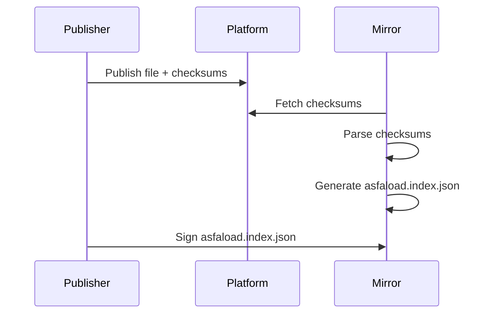
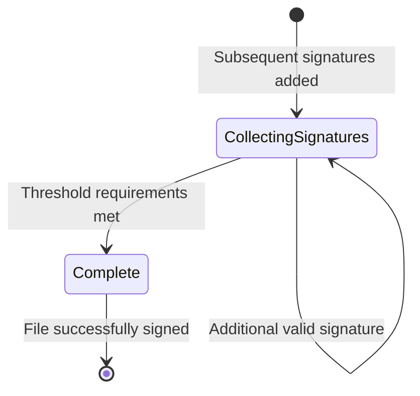
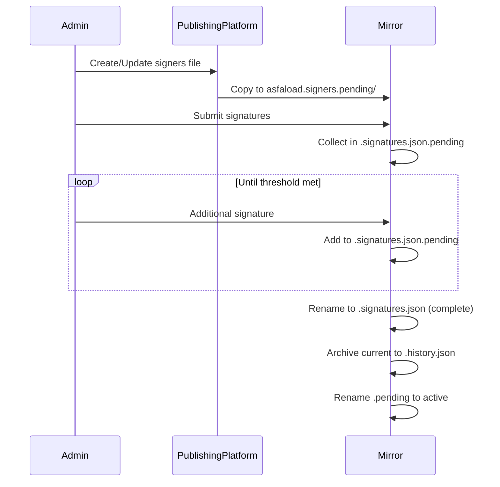
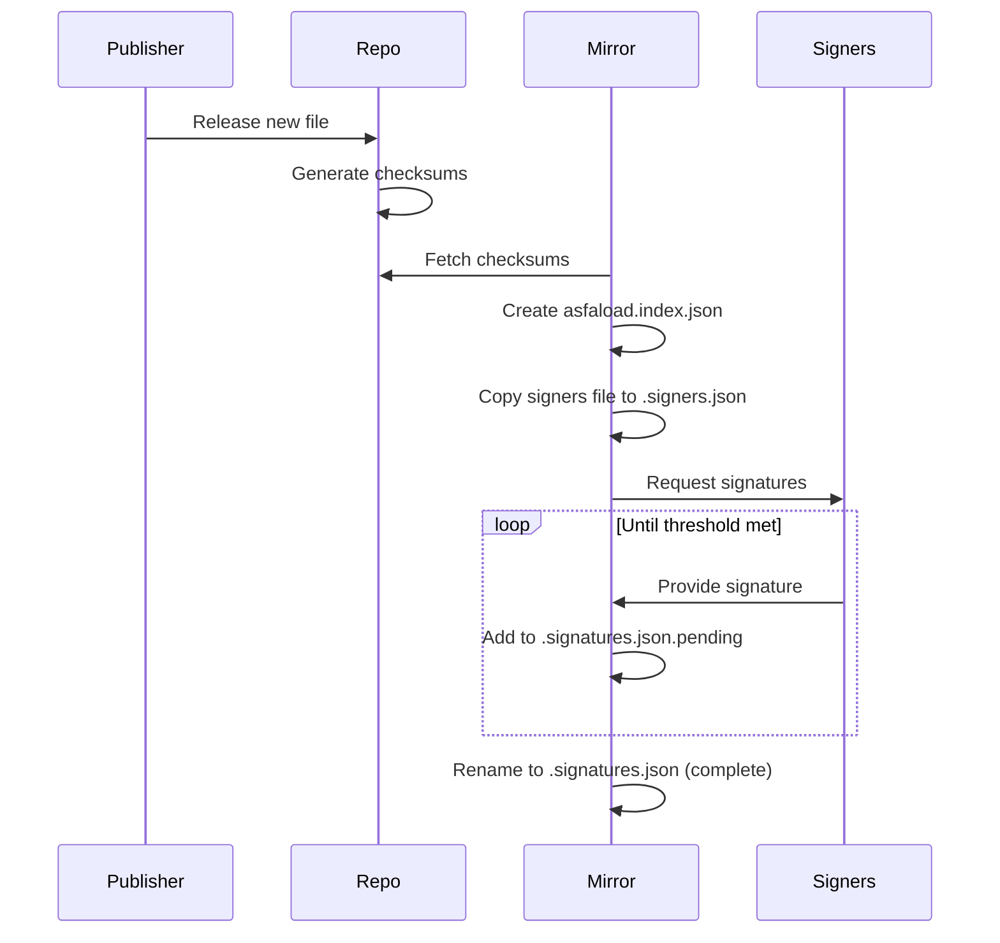
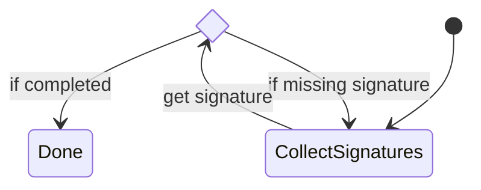
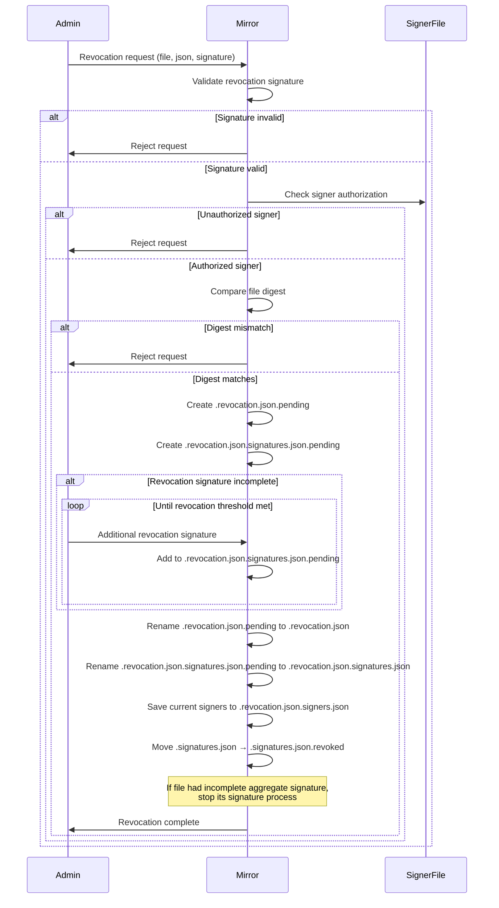
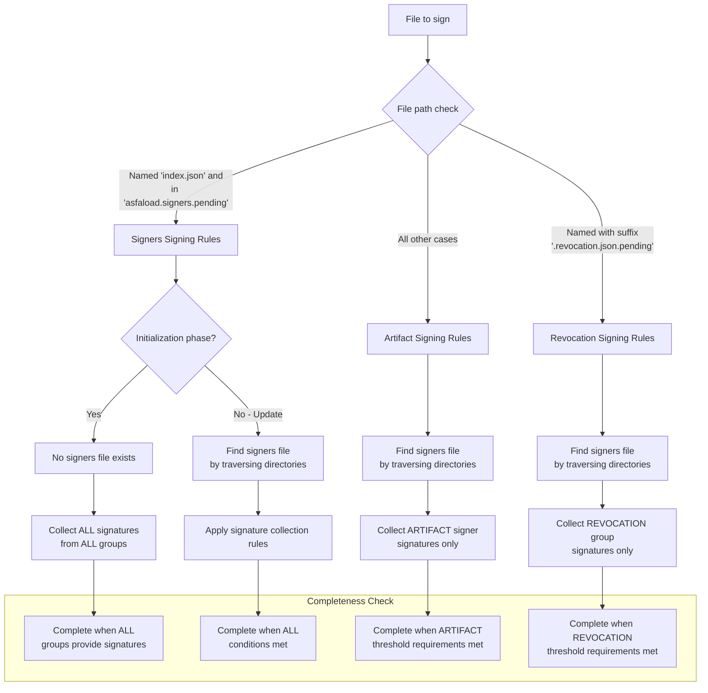
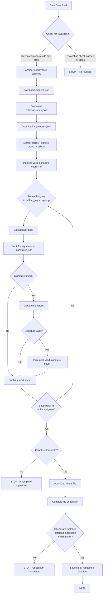

# Asfaload File Signature Specification

## 1. Introduction

This document describes the multi-signature scheme proposed by Asfaload to authenticate files published on the internet. The authentication ensures the files published were made available by the people controlling the publishing account.

## 2. Terminology

This section defines key terms used throughout this specification.

- **Artifact Signers**: Keys authorized to sign published files/artifacts
- **Admin Keys**: Keys authorized to update the signers configuration
- **Master Keys**: Keys authorized to reinitialize the signers file; intended for one-time use only, though this is not enforceable
- **Aggregate Signature**: A collection of individual signatures that aim to collectively satisfy the requirements defined in a signers file.
- **Individual Signature**: A single digital signature created by one signer's private key
- **Pending Signature**: An aggregate signature that is not yet complete
- **Complete Signature**: An aggregate signature that has met all threshold requirements
- **Mirror**: A git repository maintained by Asfaload that mirrors checksums files from publishing platforms
- **Publishing Platform**: The platform where original files are published (e.g., GitHub releases)
- **Revocation**: The action of invalidating a previously signed file due to malicious content or other emergency
- **Signers File**: A JSON file (`index.json`) defining groups of keys and their respective thresholds required to complete an aggregate signature
- **Backend Path**: The path to which a URL is mapped on disk on the backend. It includes the protocol scheme and the port as path elements mapping. If the port is not explicitly present, it uses the protocol's default port. As an example, it maps `https://github.com/asfaload/asfald` to `https/github.com/443/asfaload/asfald`
- **Download URI**: The base URI from which release artifacts can be downloaded, which may differ from the release page URI. For example Github uses different URI structures for the release web page (eg https://github.com/asfaload/asfald/releases/tag/v0.9.0) and the base URI to download artefacts (eg https://github.com/asfaload/asfald/releases/download/v0.9.0/).

## 3. Workflows

### 3.1 File Publishing Workflow

The Asfaload release signing scheme is based on an `asfaload.index.json` file containing the release artifacts' checksums (sha256 or sha512).
This file is created by the Asfaload backend in one of three ways:
*   By querying the release host's API (e.g., the GitHub REST API) for checksums.
*   By using checksums files published in the release.
*   By downloading the artifacts files and computing the sha256 (optional, only available for on-premise installations).

The resulting `index.asfaload.json` is stored in a git repository maintained by Asfaload. The path in the git repo is the backend path of the download URI of the release.
It is this `index.asfaload.json` file that will be signed by publishers.

Here is an example of such an index file:

```
{
  "mirroredOn": "2025-10-06T14:16:28.7737033+00:00",
  "publishedOn": "2025-10-06T14:15:00+00:00",
  "version": 1,
  "publishedFiles": [
    {
      "fileName": "asfald-aarch64-apple-darwin",
      "algo": "Sha256",
      "source": "checksums.txt",
      "hash": "2b33ba79f7551078b19ae40c8d2c8b87902754ba9f4ac210d27e85245fb8e43b"
    },
    {
      "fileName": "asfald-aarch64-apple-darwin.tar.gz",
      "algo": "Sha256",
      "source": "checksums.txt",
      "hash": "89408ec87de89731ebcd7169b0997c33a2a3e968bf7afd407eac11f594bd21c6"
    },
    {
      "fileName": "asfald-aarch64-unknown-linux-musl",
      "algo": "Sha256",
      "source": "checksums.txt",
      "hash": "7c18868e3b8d0edf134ac101cdbf4b243c31735d3afe58f90f0b5a82394a6154"
    }
  ]
}
```
The `version` is the format version of the index, `source` is where the `hash` value was found. In this case the file `checksums.txt` that was part of the release.
It can also be the REST url queried to get the value.



```mermaid
sequenceDiagram
    participant Publisher
    participant Platform
    participant Mirror

    Publisher->>Platform: Publish file + checksums
    Mirror->>Platform: Fetch checksums
    Mirror->>Mirror: Parse checksums
    Mirror->>Mirror: Generate asfaload.index.json
    Publisher->>Mirror: Sign asfaload.index.json
```

### 3.2 File Signing Workflow

When we say a file is signed, we actually mean that its sha512 sum is signed. We don't pass the whole file content to the signing function, the sha512 of the file is first computed, and that value is passed to the signing function.

Any file can be signed by the Asfaload scheme. The individual signatures are collected in a file named identically to the signed file, but with the suffix `.signatures.json.pending`. These individual signatures build an aggregate signature. As long as the aggregate signature is not complete, i.e. it is still missing individual signatures, it has the suffix `.signatures.json.pending`. Once complete, the file is renamed to drop the `.pending` suffix.

The format of the signatures file is

```
{
  "<format-prefixed-base64-encoded-pubkey>": "base64 signature",
   ....

}
```


The requirements to be met to have the aggregate signature considered as complete are defined in a so called signers file. Such a signers file is named `index.json` and saved in a directory named `asfaload.signers`. To find the applicable signers file for a given file, its parent directories are traversed upwards. The `index.json` within the first `asfaload.signers` subdirectory encountered defines the signature requirements.

The applicable signers file is copied alongside the signed file and named as the signed file but with the suffix `.signers.json` when the aggregate signature is completed. We need to take a copy because the applicable signers file could change between signing and verification. A new, more specific, signers file could be added in a path closer to the signed file, which would then be used for verification instead of the original. Although locating the applicable signers file using its history would still be possible, it would be cumbersome.

The content of pending signatures file is a json object where each key is the format-prefixed-base64 encoding of the public key of the signer, and the associated value is the base64 encoding of the signature. Once the required signatures, as defined in the nearest `asfaload.signers/index.json` file, are collected, the `.pending` suffix is dropped and the complete signature is made available for use. New signatures can only be added to `index.json.signatures.json.pending`, not to `index.json.signatures.json`.
The public key's format prefix is currently `minisign` or `ed25519`.


```mermaid
stateDiagram-v2
    [*] -->  CollectingSignatures: Subsequent signatures added
    CollectingSignatures --> Complete: Threshold requirements met
    CollectingSignatures --> CollectingSignatures: Additional valid signature
    Complete --> [*]: File successfully signed
```

### 3.3 Signers File Management Workflow

The signers file (`asfaload.signers/index.json`) undergoes initialization and updates. The initial signers file is published by the project on their publishing platform, then copied to the Asfaload mirror where it must be signed by all keys it mentions before becoming active. Subsequent updates follow a similar collection process, with specific signature completeness requirements.

For each update, a new version of the signers file is sent to the Asfaload backend. At that time the directory `asfaload.signers.pending` is created alongside the existing `asfaload.signers` directory it will replace. The new file is copied to `asfaload.signers.pending/index.json`, and a file `index.json.signatures.json.pending` is created in that same directory.

While collecting signatures, the new signatures are added in `asfaload.signers.pending/index.json.signatures.json.pending` and committed to the mirror. As soon as the update is signed as required (see Section 4.3), the file `asfaload.signers.pending/index.json.signatures.json.pending` is renamed to `asfaload.signers.pending/index.json.signatures.json`. That is, the signature is marked as complete.

The next step is then to activate this new signers file. The current files (`asfaload.signers/index.json` and `asfaload.signers/index.json.signatures.json`) are added in the file `asfaload.signers.history.json` and `asfaload.signers` is deleted, and the pending directory `asfaload.signers.pending` is renamed dropping the `.pending` suffix, effectively replacing the previous signers files. Previous signers can also be found by looking at the git history if needed.

> [!WARNING]
> On linux such an operation is not atomic. The backend would need to block requests while the rename takes place.


```mermaid
sequenceDiagram
    participant Admin
    participant PublishingPlatform
    participant Mirror

    Admin->>PublishingPlatform: Create/Update signers file
    PublishingPlatform->>Mirror: Copy to asfaload.signers.pending/
    Admin->>Mirror: Submit signatures
    Mirror->>Mirror: Collect in .signatures.json.pending
    loop Until threshold met
        Admin->>Mirror: Additional signature
        Mirror->>Mirror: Add to .signatures.json.pending
    end
    Mirror->>Mirror: Rename to .signatures.json (complete)
    Mirror->>Mirror: Archive current to .history.json
    Mirror->>Mirror: Rename .pending to active
```

## 4. Operations

### 4.1 Publishing Repo Operations

#### 4.1.1 Initial Signers

We start by only working with Github, but aim to support other publishing platforms, including self-hosted solutions. For Github, the initial signers file is published a branch of the code repository, which is distinct from releases location. That's why for every publication platform, we define the root location, where the initial signers file can be found, and the releases location, where files to be downloaded can be found.

##### GitHub

Before a project starts to sign releases with Asfaload, it has to communicate the signers and threshold to the Asfaload mirror. This is done by adding a file `asfaload.initial_signers.json` at the root of the git repo under an arbitrary branch that is communicated to the Asfaload backend. We suppose that only developers controlling the project can add a branch.

This file will be copied to the Asfaload mirror in the root's subdirectory `asfaload.signers.pending` of the project under the name `index.json` alongside a `metadata.json` file. Once the file has been copied to the mirror, the copy on Github is only used when verifying the whole chain of updates. If this file is not available anymore, the initial signers file cannot be linked back to the Github repository, so it is advised to keep it available.

The metadata collected alongside the signers file consists of:

* the type of origin: downloaded from a forge like github, a self-hosted fileserver, ...
  * the kind of forge (Github, Gitlab,...)
  * the url provided by the user
  * the url effectively retrieved by the system (on forges, the user can provide the html-view url, and the system translates it to the raw file url).
  * the time it was downloaded

The `metadata.json` file has the following format:

```
{
  "data": {
    "Forge": {
      "kind": "Github",
      "url": "https://github.com/user/repo/blob/main/asfaload.initial_signers.json",
      "retrieval_url": "https://github.com/user/repo/refs/heads/main/asfaload.initial_signers.json",
      "retrieved_at": "2025-11-27T14:32:05Z"
    }
  }
}
```

The `kind` field can be `Github`, `Gitlab`, or `FileServer`. The `retrieved_at` field is an ISO8601 formatted UTC date and time.

This information is not signed, but committed to the backend at the same time as the signers file.

```
{
  "version": 1,
  // timestamp at which the file was generated. Is part of the content signed so cannot be
  // updated.
  // ISO8601 formatted UTC date and time
  "timestamp": "2025-11-27T14:32:05Z",
  // ---------------------------------------------------------------------------------------------
  // These are the artifact signers accepted and their required threshold
  // Note this is an array and the threshold of each object in the array
  // has to be met for the signature to be complete.
  "artifact_signers" : [
    {
      "signers" : [
        { "kind": "key", "data": { "pubkey": "minisign:RWTsbRMhBdOyL8hSYo/Z4nRD6O5OvrydjXWyvd8W7QOTftBOKSSn3PH3"}  },
        { "kind": "key", "data": { "pubkey": "minisign:RWTUManqs3axpHvnTGZVvmaIOOz0jaV+SAKax8uxsWHFkcnACqzL1xyv"}  },
        { "kind": "key", "data": { "pubkey": "minisign:RWSNbF6ZeLYJLBOKm8a2QbbSb3U+K4ag1YJENgvRXfKEC6RqICqYF+NE"}  }
      ],
      // how many signatures are required to have
      // this requirement fulfilled
      "threshold": 2
    }
  ],
  // ---------------------------------------------------------------------------------------------
  // Following is optional.
  // Master keys, use for reinitialisation of the `index.json` file.
  // Master keys must be explicitly configured. If not present, emergency reinitialisation
  // is not available and signers file updates can only be performed through the normal
  // admin procedure. This is by design: master keys serve as an emergency recovery
  // mechanism and should be stored offline with minimal exposure, which is incompatible
  // with falling back to daily-use admin or artifact signer keys.
  "master_keys" : [
    {
        "signers": [
            { "kind": "key", "data": { "pubkey": "minisign:RM4ST3R1BdOyL8hSYo/Z4nRD6O5OvrydjXWyvd8W7QOTftBOKSSn3PH3"} },
            { "kind": "key", "data": { "pubkey": "minisign:RM4ST3R285887D5Ag2MdVVIr0nqM7LRLBQpA3PRiYARbtIr0H96TgN63"} },
            { "kind": "key", "data": { "pubkey": "minisign:RM4ST3R3USBDoNYvpmoQFvCwzIqouUBYesr89gxK3juKxnFNa5apmB9M"} },
        ],
        "threshold": 2
    }
  ],
  // Admin keys, are *optional*, but if present, are used for updates to the `index.json` file
  // When admin keys are not explicitly defined, they are made implicitly equal to the artifact signers group.
  "admin_keys" : [
    {
        "signers": [
            { "kind": "key", "data": { "pubkey": "minisign:R4DM1NJ1BdOyL8hSYo/Z4nRD6O5OvrydjXWyvd8W7QOTftBOKSSn3PH3"} },
            { "kind": "key", "data": { "pubkey": "minisign:R4DM1NL285887D5Ag2MdVVIr0nqM7LRLBQpA3PRiYARbtIr0H96TgN63"} },
            { "kind": "key", "data": { "pubkey": "minisign:R4DM1NN3USBDoNYvpmoQFvCwzIqouUBYesr89gxK3juKxnFNa5apmB9M"} },
        ],
        "threshold": 2
    }
  ],
  // The revocation keys are optional. But if present, are used for revocation of signed files.
  // When revocation keys are not explicitly defined, they fall back to admin_keys, then to artifact_signers.
  "revocation_keys" : [
    {
        "signers": [
            { "kind": "key", "data": { "pubkey": "minisign:R4DM1NJ1BdOyL8hSYo/Z4nRD6O5OvrydjXWyvd8W7QOTftBOKSSn3PH3"} },
            { "kind": "key", "data": { "pubkey": "minisign:R4DM1NL285887D5Ag2MdVVIr0nqM7LRLBQpA3PRiYARbtIr0H96TgN63"} },
            { "kind": "key", "data": { "pubkey": "minisign:R4DM1NN3USBDoNYvpmoQFvCwzIqouUBYesr89gxK3juKxnFNa5apmB9M"} },
        ],
        "threshold": 2
    }
  ]
}
```

When asfaload copies this file to the mirror, it is not signed yet. Signatures will be collected on the mirror. Each user controlling a secret key corresponding to a public key listed will have to sign the `asfaload.signers.pending/index.json` file and provide the signature to the Asfaload backend. These signatures are collected in the file `asfaload.signers.pending/index.json.signatures.json.pending`.

It also creates a file `asfaload.signers.history.json` in the root directory with the content `{entries : []}`. When signers files are updated, the historical versions will be recorded in that file. Currently only the `entries` key is defined, but others might be added if needed.

Master keys are usable only for reinitialising a signers file, and should be kept offline. They ideally should be single usage, meaning that when a signers file is reinitialised, the master keys signing the update should not be present in the new file. This cannot be enforced though (If the threshold for a master keys section is more than 1, how do we enforce single use of a master key as we don't know which of the awaiting signatures will be provided and which keys will stay unused?), and is a question of policy and good practice. Master keys are also distinct from artifact signers, i.e. an artifact key cannot be a master key.

The timestamp can help in consistency checks (entries in history should have growing timestamps, the timestamp of a signers file in history should be earlier than its obsoleted at field, ...) and avoid replays risks, where an old file is somehow injected as a new one (without the timestamp, the signatures of the old version would still be valid, here we don't accept a new version with a smaller timestamp than the current one.)

#### 4.1.2 Signing the Signers File

Before the initial signers file is made active, it has itself to be signed by all keys it mentions. As long as it is not signed, the signers file is stored in `asfaload.signers.pending/index.json`. For Github releases, the signers file will be stored in `${project_root}`, which is `https/github.com/443/${user}/${repo}` on the mirror.

Each signer provides its signature, and it is immediately added to the `asfaload.signers.pending/index.json.signatures.json.pending` file and committed to the mirror. When all signers (as required for a new signers file) have provided their respective signature, the file is renamed by the backend to remove the `.pending` suffix. At that time, the new signers file is ready to be made active.

If there is no existing signers file, the directory `asfaload.signers.pending` is renamed to `asfaload.signers`, making it active. If a signers file needs to be replaced, the signers file (`asfaload.signers/index.json`) and signatures file (`asfaload.signers/index.json.signatures.json`) are appended to the file `asfaload.signers.history.json` (sibling of the directory `asfaload.signers`) as described later in this document in `Adding the Previous Signers and Signatures to the History`.


When the previous signers data has been added to the history file, the directory `asfaload.signers.pending` can be renamed to `asfaload.signers` to replace the previous version.

Each signers/keys field in `asfaload.signers/index.json` is an array of objects. The field `kind` initially only can have the value `key`, but in the future could accept other values, for example such that the object itself can hold a group of signers with a threshold. Each object list keys and a threshold.

For a signature to be complete, the requirements of each object needs to be fulfilled. This was introduced to support requiring signatures from different groups (e.g. at least one signature from the dev group and one from the QA group.)

#### 4.1.3 Adding the Previous Signers and Signatures to the History

Here is how the format of an entry in the array stored in the file `asfaload.signers.history.json`:

```
  {
    // ISO8601 formatted UTC date and time
    "obsoleted_at": "2025-02-27T08:48:44Z",
    // The signers file content is base64-encoded to prevent JSON formatters
    // from altering whitespace, which would invalidate its signatures.
    "signers_file" : "eyJ2ZXJzaW9uIjoxLC...base64-encoded signers file content...==",
    "signatures" : { ... content of signatures file ...},
    "metadata" : { ... content of metadata file ...}
  }
```

The `signers_file` field contains the raw JSON content of the signers file, base64-encoded. This encoding ensures that the exact bytes that were signed are preserved, preventing JSON formatters or serializers from altering whitespace or key ordering, which would invalidate the signatures.

Such an entry is **appended** to the array in the file `asfaload.signers.history.json`, and the entries of the array are expected to be sorted chronologically.

### 4.2 Mirror Operations

#### 4.2.1 Key Operations

##### Master Keys

Master keys are used for:

* Reinitialisation of `asfaload.signers/index.json`
* Changes in master signers configuration

Master keys are encouraged to be one-time use keys. Master keys signing the new `asfaload.signers/index.json` file should ideally not be present in it.
Master keys are optional. If not configured, emergency reinitialisation is not available and signers file changes can only be made through the normal admin update procedure. There is no fallback to admin or artifact signer keys: master keys are an emergency recovery mechanism intended to be stored offline with minimal exposure, which is fundamentally incompatible with the higher-exposure keys used for day-to-day operations.

##### Admin Keys

Admin keys are used for the following operations:

* Changes to `asfaload.signers/index.json` admin and artifact signers config, including threshold.

Admin keys can be used multiple times. They can also be used to sign artifacts, on the condition they are explicitly listed as artifact signers. An admin key not listed as `asfaload.signers/index.json` artifact signer cannot sign an artifact.

If no admin group is configured, it is equal to the artifact signers group.

##### Artifact Signer Keys

Those keys are used for:

* artifact signing.


#### 4.2.3 New Release

The checksums files are mirrored and the `asfaload.index.json` file is created. The current `asfaload.signers/index.json` file is also copied under the release directory on the mirror and named identically to the signed file but with the added suffix `.signers.json`, so that older release can still be verified even after the signers file has been updated. In the case of the mirrored checksums files named `asfaload.index.json`, the signers file is copied to `asfaload.index.json.signers.json`.

Signatures are requested according to the signers file just copied to the release directory on the mirror. For our example, let's assume that the key `RWTsbRMhBdOyL8hSYo/Z4nRD6O5OvrydjXWyvd8W7QOTftBOKSSn3PH3` is signing the release. That user signs the `asfaload.index.json` file (reminder: its hash), and the backend puts its signature under the release directory on the mirror in the file `asfaload.index.json.signatures.json.pending`.

When required signatures are collected, the file `asfaload.index.json.signatures.json.pending` is renamed to `asfaload.index.json.signatures.json`.


```mermaid
sequenceDiagram
    participant Publisher
    participant Repo
    participant Mirror
    participant Signers

    Publisher->>Repo: Release new file
    Repo->>Repo: Generate checksums
    Mirror->>Repo: Fetch checksums
    Mirror->>Mirror: Create asfaload.index.json
    Mirror->>Mirror: Copy signers file to .signers.json
    Mirror->>Signers: Request signatures
    loop Until threshold met
        Signers->>Mirror: Provide signature
        Mirror->>Mirror: Add to .signatures.json.pending
    end
    Mirror->>Mirror: Rename to .signatures.json (complete)
```


```mermaid
stateDiagram-v2
    state completed? <<choice>>
    [*] --> CollectSignatures
    completed? --> Done: if completed
    completed? --> CollectSignatures: if missing signature
    CollectSignatures --> completed?: get signature
```

#### 4.2.4 Revocation

If a file published and signed appears to be malicious, the publishing project can revoke the signatures. As revocation is in most cases an emergency intervention, a dedicated group `revocation_keys` is defined in the signers file. It is optional though, and cascades through the following hierarchy of groups until a defined group is found:

* revocation_keys
* admin_keys
* artifact_signers

The `master_keys` are not used in this case, to limit their use to emergency signers files reset.

The revocation process always looks at the current signers. This means that if the file `asfaload.signers/index.json` has been updated since the file to be revoked was signed, the signers config used for revocation will not be the same as the one used at the time of the signing.


When a request for revocation of a signed file is received, it provides:

* the path to the file being revoked
* a json document specifying the revocation
* the signature of the json document by the private key corresponding to the public key transmitted in the request

The json document has this format (`//` commented lines are not part of the json document):

```
{
  // ISO8601 formatted UTC date and time
  "timestamp" :  "2025-02-27T08:48:44Z",
  "subject_digest" : "sha256:......",
  "initiator" : "pubkey_of_signer"
}
```

When the revocation request is received, the revoked file is located thanks to the path information given in the request. First we check the signature of the revocation json. If it is valid, we then validate if the signer is authorized to revoke a file. If either of these checks fail, stop here.


We then compute the file to be revoked's digest and compare it to the value in the json document transmitted. If it doesn't match, stop here.

If it matches, the revocation request is legitimate, apply it:

* write the revocation json document to a file named `${revoked file name}.revocation.json.pending`.
* write the signature of the revocation json document to a file named `${revoked file name}.revocation.json.pending.signatures.json.pending`.

When the revocation's aggregate signature is complete, we activate the revocation:

* remove the `.pending` suffix from the revocation file (`${revoked file name}.revocation.json.pending`)
* remove the `.pending` suffix from the signatures file and additionaly rename it to match the activated revocation file (`${revoked file name}.revocation.json.signatures.json.pending`)
* write the signers file active at the time of the revocation to a file named `${revoked file name}.revocation.json.signers.json`
* move the revoked file's `.signatures.json` file to add the suffix `.revoked`.

As these operations are not atomically applied, the client should check the presence and validity of a revocation, even if the aggregate signature `.signatures.json` file is still present and valid.
If the revocation process completes while the aggregate signature of the file is still incomplete, it will stop the signature process of the file (so the file will never have a complete signature).

The `.revocation.json.signatures.json` file is structured like other signatures file.



```mermaid
sequenceDiagram
    participant Admin
    participant Mirror
    participant SignerFile

    Admin->>Mirror: Revocation request (file, json, signature)
    Mirror->>Mirror: Validate revocation signature
    alt Signature invalid
        Mirror->>Admin: Reject request
    else Signature valid
        Mirror->>SignerFile: Check signer authorization
        alt Unauthorized signer
            Mirror->>Admin: Reject request
        else Authorized signer
            Mirror->>Mirror: Compare file digest
            alt Digest mismatch
                Mirror->>Admin: Reject request
            else Digest matches
                Mirror->>Mirror: Create .revocation.json.pending
                Mirror->>Mirror: Create .revocation.json.signatures.json.pending
                alt Revocation signature incomplete
                    loop Until revocation threshold met
                        Admin->>Mirror: Additional revocation signature
                        Mirror->>Mirror: Add to .revocation.json.signatures.json.pending
                    end
                end
                Mirror->>Mirror: Rename .revocation.json.pending to .revocation.json
                Mirror->>Mirror: Rename .revocation.json.signatures.json.pending to .revocation.json.signatures.json
                Mirror->>Mirror: Save current signers to .revocation.json.signers.json
                Mirror->>Mirror: Move .signatures.json → .signatures.json.revoked
                Note over Mirror: If file had incomplete aggregate signature,<br/>stop its signature process
                Mirror->>Admin: Revocation complete
            end
        end
    end
```

### 4.3 Aggregate Signature Completeness

As signers files contain different groups with distinct purposes, we have to determine rules defining which signers groups apply to which circumstances.

If the file being signed is named `index.json` and is stored in a directory named `asfaload.signers.pending`, the signers signing rules apply.
If the file being signed's name has the suffix `.revocation.json.pending`, the revocation signing rules apply.
Otherwise, artifact signing rules apply.


```mermaid
flowchart TD
    A[File to sign] --> B{File path check}
    B -->|Named 'index.json' and<br/>in 'asfaload.signers.pending'| C[Signers Signing Rules]
    B -->|Named with suffix<br/>'.revocation.json.pending'| R[Revocation Signing Rules]
    B -->|All other cases| D[Artifact Signing Rules]

    C --> E{Initialization phase?}
    E -->|Yes| F[No signers file exists]
    F --> G[Collect ALL signatures<br/>from ALL groups]

    E -->|No - Update| H[Find signers file<br/>by traversing directories]
    H --> I[Apply signature collection rules]

    D --> J[Find signers file<br/>by traversing directories]
    J --> K[Collect ARTIFACT signer<br/>signatures only]

    R --> S[Find signers file<br/>by traversing directories]
    S --> T[Collect REVOCATION group<br/>signatures only]

    G --> L[Complete when ALL<br/>groups provide signatures]
    I --> M[Complete when ALL<br/>conditions met]
    K --> N[Complete when ARTIFACT<br/>threshold requirements met]
    T --> U[Complete when REVOCATION<br/>threshold requirements met]

    subgraph Completeness Check
    L
    M
    N
    U
    end
```

#### 4.3.1 Artifact Signing Rules

##### Signers File Identification

The signers file is found by recursively traversing parent directories from the file's location, until a directory named `asfaload.signers` is found. In that directory, the file `index.json` is the signers file that applies.

If an `asfaload.signers` directory is not found, an aggregate signature cannot be constructed: individual signatures are rejected and no file with the suffix `.signatures.json.pending` is created.

##### Signature Collection Rule

When receiving an individual signature, check its author is member of the `artifact_signers` group. If it is, collect the signature, otherwise ignore it.

##### Completeness Rules

An aggregate signature subject to artifact signing rules is complete if the requirements of the artifact signers group of signers file are met. This is the simplest and most straight-forward case, but also the most common.

#### 4.3.2 Signers Signing Rules

##### Signers File Identification

The signers file is looked for similarly as for the artifact signing rules. However, if no signers file can be found, we are in the initialisation phase of the signers file. Individual signatures are collected and accumulated in the file `asfaload.signers.pending/index.json.signatures.json.pending`.

##### Signature Collection Rule

If this is an **initialisation** of the signers file, all signers present in all groups have to sign the file.

If this is an **update** of the signers file:

* when we collect the signatures for an update, a signature is collected if the signer meets any of the following criteria:
  * Is a member of the `admin_keys` or `master_keys` group in the **current** signers file.
  * Is a **new signer** (present in the new signers file but not the current one).
  * Is a member of the `admin_keys` or `master_keys`group in the **new** signers file.

Signatures from signers who do not meet any of these criteria are ignored.

##### Completeness Rules

To have the signature complete, and make the transition to the new setup, 3 conditions have to be met:

* The current signers file has to be respected at the admin or master group level.
* The new signers file's requirements must also be met at the admin or master group level.
* Any new signer is required to sign, including new signatories in the new master group.

Here are examples where we consider only the admin group:

Example:
old: { threshold 2, signers [ A, B, C ]}
new: { threshold 3, signers [ A, B, C, D]}

This leads to these condition having to be met before transitioning to the new signature config:

* We need 2 signatures from A B C
* We need 3 signatures from A B C D
* We need signature D as it is a new signer.

An acceptable set of signatures of A B D, as it fulfills all 3 conditions.

Lowering the threshold example:
old: { threshold 3, signers [ A, B, C, D]}
new: { threshold 2, signers [ A, B, C, D]}

This leads to these conditions having to be met:

* 3 signatures from A B C D
* 2 signatures from A B C D, which is covered by the first condition
* no new signer is added, so no additional signature is required

Changing signers:
old: { threshold:3, signers A, B, C, D}
new: { threshold:4, signers A, E, F, G}
This leads to these conditions having to be met:
* 3 signatures from A B C D
* 4 signatures from A E F G
* require signatures from E F G, which is covered by previous condition

> [!NOTE]
> The initial signers file process is a special case of these conditions, where there is no current config, and where all signers are new, which lets us condense everything in one requirement (all signers need to sign).

#### 4.3.3 Revocation Signing Rules

##### Signers File Identification

The applicable signers file is found by traversing parent directories from the revoked file's location, looking for the current `asfaload.signers/index.json`, similarly to the artifact signing rules. Note that the release-specific copy (`.signers.json`) is not used; revocation always uses the current active signers file, as stated in section 4.2.4.

If no signers file is found, the revocation request is rejected.

##### Signature Collection Rule

The revocation signers are the members of the group identified like this:

* If the `revocation_keys` group is defined, use it for revocation.
* If no `revocation_keys` group is present, the `admin_keys` group is used.
* If the latter is not defined, the `artifact_signers` group is used.

The `master_keys` group is not used in this process.

When receiving an individual signature, check if its author is a member of the identified revocation group. If it is, collect the signature; otherwise, ignore it.

##### Completeness Rules

The revocation aggregate signature is complete when the threshold requirements of the applicable revocation group are met.

## 5. Security Analysis

### 5.1 Key Compromise

A key compromise is the event making the private key of a signer available to a third-party not supposed to have it. If not handled correctly, such an event can be catastrophic and lead to publication and seemingly valid signing of malicious software. Handling it correctly however is hard and may require some constraints.

Multi-signatures accounts can limit the impact of a key compromise, but only under certain circumstances. For example, a 1-of-2 account does not bring any protection against key compromise, as the compromised key can take any action, including updating the signers. As a conclusion, we can say that to protect against key-compromise, the multi-sig needs to require more than one signature (in m-of-n, m>1).

Also, per definition, an m-of-n multi-sig with n>m can protect against m-1 key compromise. (Compromised keys alone cannot validly sign, and the participation of at least one non-compromised key is needed).

Of note is that the compromised key can still be used by its owner to sign multi-sig operations as long as it has not been revoked. This means that the compromised key can still participate in the m-of-n multi-sig to validate signers updates.

> [!NOTE]
> An m-of-n account can protect against the compromise m-1 keys.

### 5.2 Key Loss

A key loss event is quiet similar to a key compromise, with the difference that the key cannot sign anything. If in the case of a key-compromise, said key can still participate to sign updates to the signers list, this is not the case with a key loss. It means that remaining signers should be able to sign changes.

As a conclusion, to protect against a key loss, we need to have m<n. For a 3-of-5 account, we require the signature of 3 keys out of 5, meaning it can handle 2 key losses. We can generalise this and say that an account m-of-n protects against n-m key losses.

> [!NOTE]
> An m-of-n account can protect against n-m key losses.

### 5.3 Key Compromises and Key Losses

For an m-of-n account, the worst situation is to have m-1 key compromised, and n-m other keys lost. In that case, updates to the signers list can be signed by the m-1 owners of the compromised keys. With n-m keys lost, it still means that m keys are available. m-1 of these are compromised, but it means that on key is still safe and will be able to limit updates to the signers list to legitimate updates.

At the other end of the spectrum, if all lost keys are amongst the compromised keys, we are still safe. We have m-1 keys compromised, and n-m keys lost. If n-m>m-1, it means we have lost access to all compromised keys in addition to some non-compromised keys. All accessible keys remaining are not compromised and can be safely used to update the signers list.

We can illustrate this with a 3-of-8. Let's say we have the keys labeled `A` `B` `C` `D` `E` `F` `G` `H`. We have 3-1 = 2 compromised keys (let's say A B, which we mark with *), and 8-3 = 5 keys lost (which we mark with x), of which 2 are compromised: `Ax*` `Bx*` `Cx` `Dx` `Ex` `F` `G` `H`

If n-m < m-1, it means we have lost less keys than the number of compromised keys. For example, in a 3-of-4, we have 3-1 = 2 (compromises handled), and 4-3=1 (key loss handled). Let's say we have the 4 keys labels `A`, `B`, `C`, and `D` and `A` and `B` are compromised (we mark them with a `*`). As stated earlier, in this case all keys lost are amongst the compromised keys. So let's say `A` is lost (we mark it with `x`).

We end up with these keys: `Ax*` `B*` `C` `D`. We see we have keys `B*` `C` `D` available to generate a valid signature, and we need to use a compromised key to sign the signers update. We can generalise and say that when n-m < m-1 we will need to use compromised keys to update the signers list. But as the update still requires the signature of a non-compromised key, the update is safe.

Multi-sig accounts protect against any combination between these two extremes.

### 5.4 Signers Security

Ideally, with a `m-of-n` account, `m>1` and `n>m`. However we recognise that a solo developer working occasionally on a small project, handling multi-sig keys might be too big a burden. For other accounts, catastrophic events could lead to loss of more than `n-m` keys or the compromise of `n`.

Even though the number of occurrence of these events should be small, we need to let publisher reset their signers files. That's why we include master key(s) in the `asfaload.signers/index.json`. Those keys are supposed to be stored safely offline, possibly printed on paper, and are meant to only be used one time.

Using master keys to sign a new `asfaload.signers/index.json` file bypass the normal procedure usually followed when updating the `asfaload.signers/index.json` file.

### 5.5 Backend compromises

In this section we analyse the consequences of our backend being compromised and the countermeasures we can take.

#### 5.5.1 Overwriting the signers file

An attacker gaining access to our backend server can try to replace a signers
file of a project with their own signers file.

If it is an **existing project already registered with asfaload**:
In that case the attacker has to replace the whole signers file history in the
Git repo. This can be detected and mitigated if by using a clone of the repo that
only accepts to pull commits that are validated against some rules. These rules are:
* Only accept to pull commits that add to the history file.

If it is a **project that is not registered with asfaload**, it is harder to detect.
It can be detected if we register where the initial signers file was
retrieved from. The Git clone would only accept to pull a commit
registering a project if it can find the initial signers file itself.
#### 5.5.2 Adding a signers file in an intermediate directory

When looking for a signers file, our backend travels up the directory hierarchy
from the file that is signed to the root of the Git repository.
If an attacker adds a signers file in a directory between the signed file and the
legit signers file, it can interfere with the signatures verification of the
clients.

As it makes no sense for a signers file to be present in an intermediate directory,
the git mirror can validate commits it pulls and error out if an additional signers file
is present.

#### 5.5.3 Backend mirror

The git repo of our backend should be mirrored to read-only static http servers that
can be used by clients to retrieve signers files, index files and signatures.
For increased security the clients should not contact the backend directly.
This is not implemented yet, as locating a signers file from a release artifact url
is not possible for a static http server, and is only possible on the backend.

Of course, the mirror itself can be compromised, but it should be a minimal
static http server with no access to it. The server fetches commits from the
backend and validates them. In case of problems, it reports it for
investigation. During that case, the mirror does not update. It is an urgent
operation concern to investigate and fix the situation, but it is better to
have a non-progressing mirror than one advertising malicious content.

Having multiple mirrors is also a mitigating factor, helping to detect if a
mirror was compromised. The client can choose a random mirror to retrieve data,
and validate the data against other mirror(s). This slows down validation, but
can be interesting for users with higher security requirements.

**TODO** Implement backend mirror

## 6. Downloading a File

The following procedure describes how a downloader tool verifies the authenticity of a file before accepting it.


```mermaid
flowchart TD
    A[Start Download] --> B{Check for revocation?}
    B -->|Revocation check fails any step| C[Consider not revoked - continue]
    B -->|Revocation check passes all steps| D[STOP - File revoked]

    C --> E[Download .signers.json]
    E --> F[Download asfaload.index.json]
    F --> G[Download .signatures.json]

    G --> H[Extract artifact_signers group threshold]
    H --> I[Initialize valid signature count = 0]
    I --> J{For each signer<br/>in artifact_signers group}
    J --> K[Extract public key]
    K --> L[Look for signature in .signatures.json]
    L --> M{Signature found?}
    M -->|No| N[Continue next signer]
    M -->|Yes| O[Validate signature]
    O --> P{Signature valid?}
    P -->|No| N
    P -->|Yes| Q[Increment valid signature count]
    Q --> N

    N --> R{Last signer in<br/>artifact_signers?}
    R -->|No| J
    R -->|Yes| S{Count >= threshold?}
    S -->|No| T[STOP - Incomplete signature]
    S -->|Yes| U[Download actual file]

    U --> V[Compute file checksum]
    V --> W{Checksum matches<br/>asfaload.index.json<br/>and platform?}
    W -->|No| X[STOP - Checksum mismatch]
    W -->|Yes| Y[Save file at requested location]
    Y --> Z[Done]
```

* **Step 0**: The downloader tool first checks if the file was revoked, and considers the file not revoked if any of these steps fails:
  * download the `.revocation.json` file
  * download the revocation file's signature (`${revoked file name}.revocation.json.signatures.json`),
  * get the (copy of the) signers file that was valid at the time of the revocation (`revocation.json.signers.json`).
  * validate the signature of the revocation document.
  * validate that the signer had the right to revoke at the revocation time. If both checks pass, stop downloading. Although this creates an opportunity to DoS the system, we don't wait to check that the file we download has the same digest because:
    * or it has the same digest of the revoked file, and we delete the downloaded file due to revocation
    * or it has another digest, and something strange is going on. We don't know if the revocation is buggy, or if the file we downloaded was somehow injected in the system to replace the revoked file.

* **Step 1**: The downloader tool downloads the file's signers file on the mirror (`asfaload.index.json.signers.json`), so it identifies the current signers on the mirror in the release directory.

* **Step 2**: The downloader downloads the file `asfaload.index.json`.

* **Step 3**: The downloader downloads the file `asfaload.index.json.signatures.json`.

 * **Step 4**: Verify signatures of the **artifact_signers** group:
  * **Step 4a**: Extracts the threshold of the artifact_signers group
  * **Step 4b**: The downloader initialises its valid signature count to 0.
  * **Step 4c**: For each signer, it extracts the public key, and looks for it in `asfaload.index.json.signatures.json`.
  * **Step 4d**: As the downloader tool knows the public key, the signature, and the `asfaload.index.json` file, it can validate the signature:
    * **Step 4d.1**: It computes the sha512 of the file `asfaload.index.json`
    * **Step 4d.2**: If the signature is valid for the sha512 computed, it increases the group's valid signatures count by 1.
  * **Step 4e**: If after going over the last signer of the artifact_signers group the signature count is lower than the threshold, stop here and report an incomplete signature.

> [!NOTE]
> The signers file json format supports the recursive definition of subgroups in each of the `artifact_signers`, `admin` and `master` groups. This is not implemented yet and still needs to be refined

* **Step 5**: The file to be downloaded is now effectively downloaded

* **Step 6**: Once downloaded, the file's checksum is computed. The algorithm chosen by default is the best one found for the file (sha512 > sha256)

* **Step 7**: The checksum computed is compared to the checksums found in the `asfaload.index.json` and with the checksums file on the publishing platform. If all correspond, the file is saved at the requested location.
